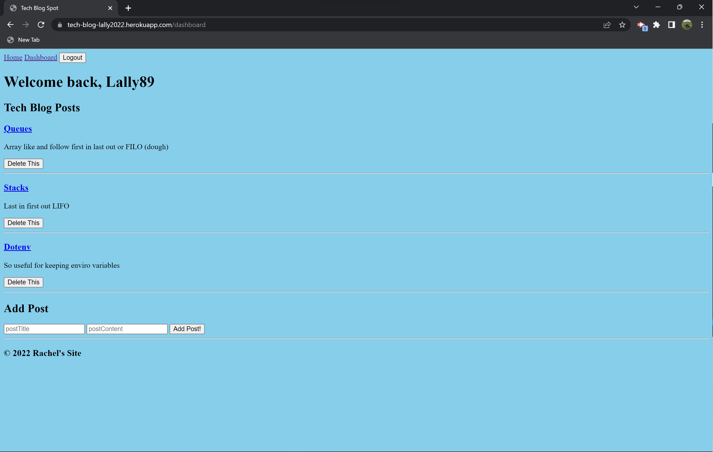
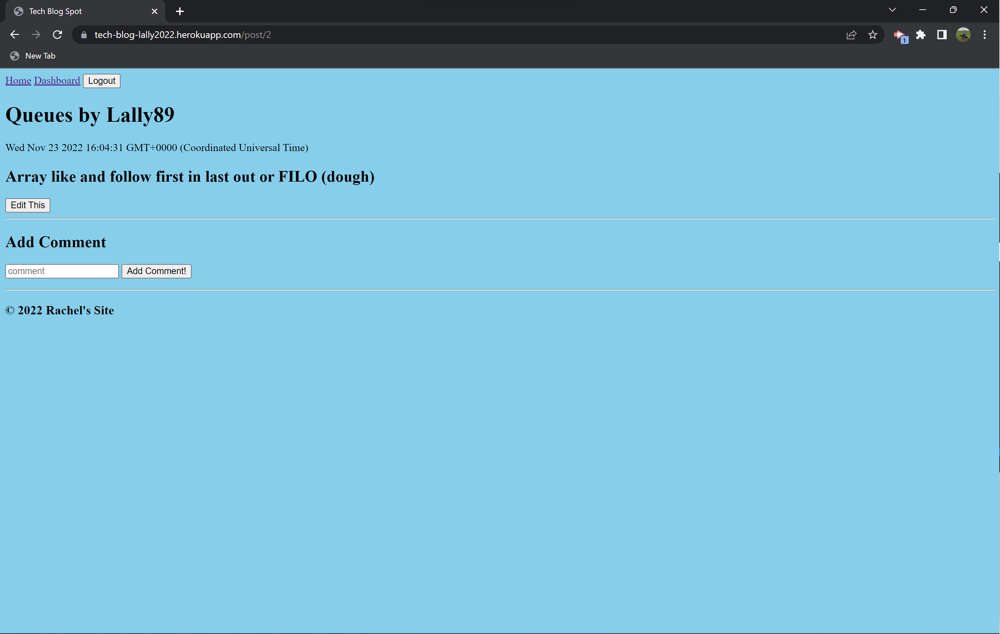

# Tech Blog Spot
A CMS-style blog spot to write about tech

## Description

As a new developer, being able to build confidence in programming can be a slow process.  Writing about tech is just another way to grapple with all the new concepts.  Hopefully by creating this site, I will gain confidence learning and writing about tech in order to grow in my new role as a developer.

I learned more about the uses of handlebars for templating a website.  I learned to apply CRUD functionality to a site.  I became more comfortable with routing backend data and front end functionality.  I learned how to deploy a site to Heroku.    

## Installation

To install, git clone the repo.  Run `npm i` to install all necessary packages. Run `npm run seed` to seed the database.  Run `node server.js` to view and edit on local browser.

## Usage

The tech blog is viewable at: https://tech-blog-lally2022.herokuapp.com/ 

Users must first sign up to create an account.  Once logged in, they can view all posts on the Homepage.  Users can navigate to their Dashboard to view all of their posts.  They can also write new posts, comment on other posts, edit exisiting posts, and delete posts.

## Credits

Thank you to the instructional staff at the University of Washington Coding Bootcamp.

## License

MIT License

Copyright (c) 2022 rachlally

